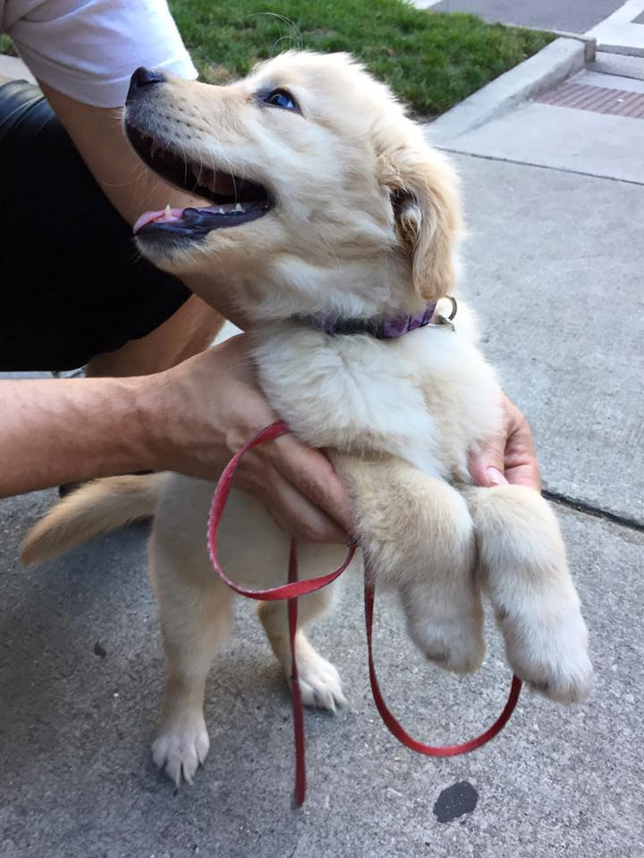

# Dog-Breed-Classifier
Given an image of a dog, algorithm will identify an estimate of the canine’s breed. If supplied an image of a human, the code will identify the resembling dog breed.


As part of my deep learning nanodegree (Convolutional Neural Networks (CNN)), I created a cnn (from scratch) and (transfer learning) to classify images as containing humans, dogs, or neither, and in the first two cases predict the best resembling dog breed of the images subject.

The breed classifier model was trained on a dataset of 13000+ dog images labeled by breed and ran for 100 epochs with a 0.0001 learning rate. The model used a pretrained resnet50 model as it's base, with one fully connected layer as final linear layer to handle the classification of 133 different dog breeds.

# Getting Started
## Download
Download dog image file from https://s3-us-west-1.amazonaws.com/udacity-aind/dog-project/dogImages.zip

Download dog image file from https://s3-us-west-1.amazonaws.com/udacity-aind/dog-project/lfw.zip




### Prerequisites

* Python 3.
* Numpy 
* Pandas
* MatPlotLib
* OpenCv
* Pytorch. 

## Project Instruction

### Instructions
1. Clone the repository and navigate to the downloaded folder.
	```	
	git clone https://github.com/shyamStarwalt/Dog-Breed-Classifier.git
	cd Dog-Breed-Classifier
	```
2. Open the Dog-breed_classifier.ipynb
	```
  
	jupyter notebook Dog-breed_classifier.ipynb
		
	```
3. Read and follow the instructions! This repository doesn't include any dataset you need. You can check out the getting started to download them.

## Project Information

### Contents

- Intro
- Step 0: Import Datasets
- Step 1: Detect Humans
- Step 2: Detect Dog
- Step 3: Create a CNN to Classify Dog Breeds (from Scratch)
- Step 4: Create a CNN to Classify Dog Breeds (using Transfer Learning)
- Step 5: Write Your Algorithm
- Step 6: Test Your Algorithm

## Losses

### Model scratch:
Training loss: 3.508 ... Validation loss: 0.127

### Transfer model:
Training loss: 1.141 ... Validation loss: 0.021 

### Accuracy:

### Model scratch:
Accuracy : 14%

### Transfer model:
Accuracy : 76%


